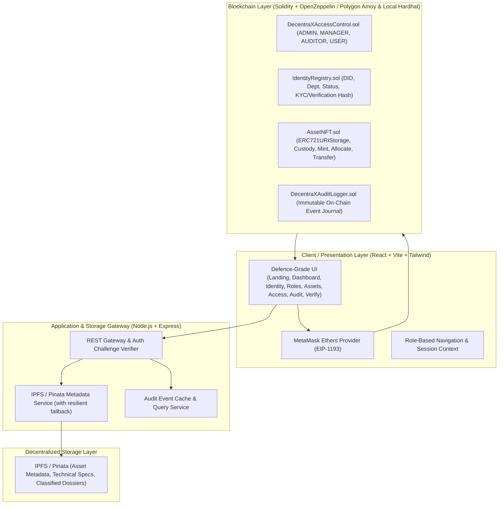

# DecentraX: System Architecture & Implementation Plan
**Smart India Hackathon 2026 — Problem Statement SIH26125**  
**Organization:** Bharat Electronics Limited (BEL)  
**Theme:** Blockchain & Cybersecurity  
**Platform:** DecentraX — "Secure • Verify • Empower"

---

## 1. Current Workspace Status Assessment
- **Directory:** `c:\Users\Asus\OneDrive\Desktop\sih_2026`
- **Initial State:** Empty directory (clean slate).
- **Environment:** Node.js v24.12.0, npm 11.6.2, Windows OS (PowerShell).
- **Existing Code:** None. Clean implementation required following strict defence-grade standards.

---

## 2. Architecture Map

---

## 3. Data Strategy (On-Chain vs Off-Chain)

| Domain | On-Chain Data (Immutable / Verifiable) | Off-Chain Data (IPFS / Secure Store) |
| :--- | :--- | :--- |
| **Identity** | Wallet address, DID URI (`did:decentrax:<addr>`), Role Bitmask, Status (Active/Suspended), Registered Block/Timestamp | Full Personnel Profile, Clearance Level, Departmental Certs, Off-chain PII (Encrypted/Hashed) |
| **Access Control** | Role hashes (`ADMIN_ROLE`, `MANAGER_ROLE`, etc.), Address grants/revocations, Permission bitmask | Detailed policy descriptions, resource access logs |
| **Assets** | Token ID, Owner address, Mint timestamp, Metadata URI (`ipfs://<CID>`), Custody state, Status flag | Extended technical specs, schematics, high-resolution imagery, serial numbers, cryptographic checksums |
| **Audit** | Indexed Events (`IdentityRegistered`, `RoleAssigned`, `AssetMinted`, `AssetAllocated`, `AssetTransferred`, `AccessEvaluated`) with block number, tx hash, actor | Search indices, action descriptions, enriched metadata |

---

## 4. Component Implementation Roadmap

### Phase 1: Smart Contracts & Local Blockchain Toolchain
1. Initialize Hardhat project with OpenZeppelin contracts (`@openzeppelin/contracts`).
2. Contracts:
   - `DecentraXAccessControl.sol`: Fine-grained RBAC with role hierarchy.
   - `IdentityRegistry.sol`: Decentralized Identifier (DID) registration, verification status, department binding.
   - `AssetNFT.sol`: ERC-721 token representing physical/digital defence asset custody with strict role requirements (Manager to mint/allocate).
   - `DecentraXAuditLogger.sol`: Append-only security audit event logger.
3. Automated test suite for contracts verifying:
   - Unauthorized minting reverts.
   - Role revocation prevents restricted execution.
   - Identity registration emits DID events.
4. Deployment script targeting both Polygon Amoy (ChainId: 80002) and Hardhat local node (ChainId: 31337).

### Phase 2: Backend API & IPFS Gateway
1. Express server in `/backend`:
   - `/api/ipfs/upload`: Accepts asset metadata and documents, pins to IPFS/Pinata with local verifiable fallback CID generator if Pinata API keys are unset.
   - `/api/auth/challenge`: EIP-712 / message signing verification for server session.
   - `/api/audit`: Query historical events from contracts & indexed logs.
   - `/api/verify`: Independent verification endpoint checking on-chain contract state against IPFS CID.

### Phase 3: Defence-Grade Frontend
1. Vite + React + TypeScript + Tailwind CSS.
2. Design System:
   - Palette: Deep Slate (`#0F172A`), BEL Navy (`#1E3A8A`), Trust Green (`#059669`), Alert Amber (`#D97706`), Neutral Gray (`#F8FAFC`).
   - Clean professional typography, crisp borders, accessibility, high readability for defence/enterprise evaluation.
3. Screens & Modules:
   1. **Landing & Connection Screen**: System posture, Network checker (Polygon Amoy / Localhost), Connect Wallet, BEL SIH 2026 header.
   2. **Operational Dashboard**: Real-time telemetry, active role, wallet DID, asset stats, quick security posture.
   3. **Decentralized Identity (DID) Portal**: Register identity, view DID document, verify identity cryptographic status.
   4. **Role-Based Access Control (RBAC) Console**: Role matrix, assign/revoke roles, verify permissions on-chain.
   5. **Interactive Access Control Evaluator**: Test role-resource action evaluation with live contract verification (Allow / Deny with justification).
   6. **Digital Asset Management**: Asset directory, lifecycle state, custody tracking, filter by category (Hardware, Crypto Key, Tactical Software, Defense Document).
   7. **NFT Mint / Asset Ingestion**: Form with metadata upload -> IPFS CID generation -> ERC-721 minting transaction -> automatic verification.
   8. **Asset Custody Allocation & Transfer**: Transfer custody between verified identities.
   9. **Verifiable Audit & Chain of Custody**: Searchable immutable audit trail with transaction hashes and block explorer links.
   10. **Auditor & Verification Suite**: Standalone verification tool for judges: paste any Wallet / Asset ID / Tx Hash to get cryptographic proof of validity.

### Phase 4: Integration, Testing & Hackathon Judge Ready Demo Script
- Demo workflow verification (Steps 1–12 as required in problem statement).
- Documentation, `.env.example`, deployment guides, and network setup.
