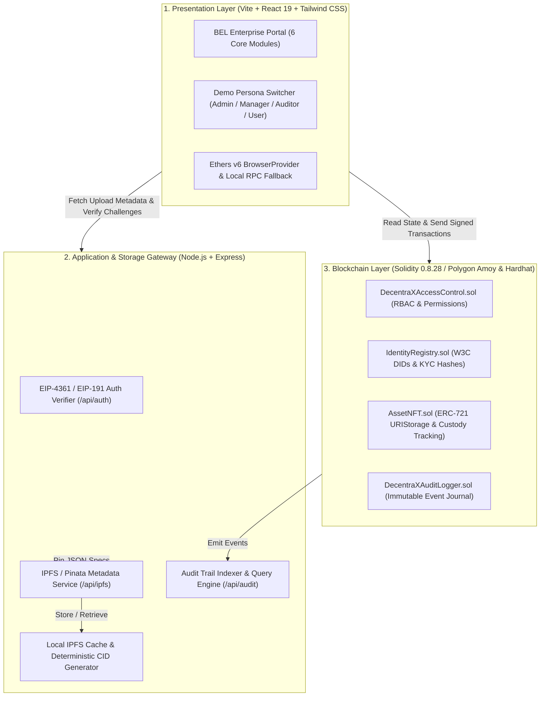
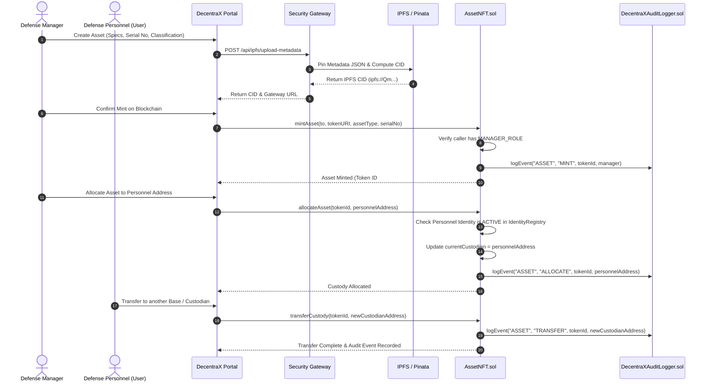

# DecentraX: Blockchain-Based Platform for Identity, Access Control & Digital Asset Management

<div align="center">

```
  ____                            _               __  __
 |  _ \  ___   ___  ___  _ __   | |_  _ __  __ _ \ \/ /
 | | | |/ _ \ / __|/ _ \| '_ \  | __|| '__|/ _` | \  / 
 | |_| |  __/| (__|  __/| | | | | |_ | |  | (_| | /  \ 
 |____/ \___| \___|\___||_| |_|  \__||_|   \__,_|/_/\_\
                                                        
            S E C U R E  •  V E R I F Y  •  E M P O W E R
```

**Smart India Hackathon 2026 | Problem Statement ID: SIH26125**  
**Organization:** Bharat Electronics Limited (BEL)  
*A Navratna PSU under the Ministry of Defence, Government of India*  
**Theme:** Blockchain & Cybersecurity  

[](https://soliditylang.org/)
[](https://hardhat.org/)
[](https://openzeppelin.com/contracts/)
[-8247E5?logo=polygon)](https://polygon.technology/)
[](https://react.dev/)
[](https://www.typescriptlang.org/)
[](https://tailwindcss.com/)
[](https://expressjs.com/)
[](https://pinata.cloud/)

</div>

---

## 📋 Table of Contents

1. [Executive Summary & Problem Statement](#-executive-summary--problem-statement)
2. [Key Innovations & Defence-Grade Value](#-key-innovations--defence-grade-value)
3. [The 6 Core Modules](#-the-6-core-modules)
4. [System Architecture & Data Flow](#-system-architecture--data-flow)
5. [Data Strategy (On-Chain vs. Off-Chain)](#-data-strategy-on-chain-vs-off-chain)
6. [Smart Contracts Architecture](#-smart-contracts-architecture)
7. [Backend Security Gateway & IPFS Engine](#-backend-security-gateway--ipfs-engine)
8. [Frontend Web Portal & BEL Design System](#-frontend-web-portal--bel-design-system)
9. [Security, Privacy & DPDP Compliance](#-security-privacy--dpdp-compliance)
10. [Technology Stack](#-technology-stack)
11. [Step-by-Step Installation & Quickstart](#-step-by-step-installation--quickstart)
12. [Pre-Funded Demo Accounts & Credentials](#-pre-funded-demo-accounts--credentials)
13. [Smart Contract Testing & Verification](#-smart-contract-testing--verification)
14. [Polygon Amoy Testnet Deployment](#-polygon-amoy-testnet-deployment)
15. [REST API Documentation](#-rest-api-documentation)
16. [Directory Structure](#-directory-structure)
17. [Hackathon Submission & Team Details](#-hackathon-submission--team-details)

---

## 🎯 Executive Summary & Problem Statement

### The Problem (SIH26125)
In strategic defense organizations like **Bharat Electronics Limited (BEL)**, defense research bodies, and military logistics divisions, sensitive assets (avionics schematics, encryption keys, tactical radar modules, hardware keys, classified dossiers) and high-clearance personnel identities are traditionally managed via centralized relational databases or disparate siloed software.

This legacy model suffers from severe vulnerabilities:
- **Single Point of Failure (SPOF):** Centralized identity repositories and asset tracking databases are prime targets for Advanced Persistent Threats (APTs) and state-sponsored cyber warfare.
- **Insider Threat & Credential Forgery:** Database administrators or compromised administrative credentials can silently alter permissions, reassign asset custody, or alter records without triggering irreversible audit alarms.
- **Opaque Custody Transfers:** Physical and digital defense equipment often cross organizational divisions without an immutable, cryptographic chain of custody.
- **Tampered Audit Trails:** Log files stored in centralized logging servers can be modified, truncated, or erased by attackers aiming to cover their tracks.

### The DecentraX Solution
**DecentraX** is a decentralized, zero-trust, enterprise defense portal engineered specifically for **Bharat Electronics Limited**. By unifying **W3C Decentralized Identifiers (DIDs)**, **multi-tier Role-Based Access Control (RBAC)**, **ERC-721 tokenized defense assets with IPFS content-addressed storage**, and **tamper-proof on-chain audit logging**, DecentraX guarantees:
1. **Zero-Trust Identity Verification:** No raw Personally Identifiable Information (PII) is stored on-chain. Only cryptographic identity hashes and DIDs (`did:decentrax:<address>`) are anchored to the blockchain.
2. **Cryptographic Chain of Custody:** Assets cannot be transferred or allocated without verifiable signatures from authorized managers, recorded immutably on the distributed ledger.
3. **Non-Repudiation Audit Logs:** Every state transition emits an on-chain event recorded in `DecentraXAuditLogger.sol`, ensuring mathematical certainty and complete audit compliance.
4. **Authentic BEL Enterprise Interface:** Styled according to official Bharat Electronics Limited branding (`#004B87` BEL Corporate Blue, Ministry of Defence credentials, National Emblem of India, and bilingual English/Hindi typography) without distracting fictional simulator clutter.

---

## 🛡️ Key Innovations & Defence-Grade Value

| Feature | Legacy Centralized System | DecentraX Blockchain Platform |
| :--- | :--- | :--- |
| **Trust Model** | Perimeter-based (Implicit Trust) | **Zero-Trust (Continuous Cryptographic Verification)** |
| **Identity Standard** | Centralized Username/Password & DB Rows | **W3C Decentralized Identifiers (DID) + SHA-256 KYC Hashes** |
| **Access Control** | Relational DB tables prone to SQL injection | **Solidity OpenZeppelin AccessControl Smart Contracts** |
| **Asset Tracking** | ERP inventory records easily edited or deleted | **ERC-721 URIStorage NFTs with Pinata IPFS Content CIDs** |
| **Custody Transfers** | Paper sign-offs or internal ticket approvals | **Cryptographic On-Chain Sign-off with Physical Custody Disclaimers** |
| **Audit Logs** | Central syslog files vulnerable to log poisoning | **Append-Only, Tamper-Proof Smart Contract Event Journal** |
| **Privacy / DPDP Act** | High risk of massive PII data leaks | **Zero Raw PII On-Chain; Off-chain cryptographic proofs only** |

---

## 📦 The 6 Core Modules

DecentraX is architected around exactly **six functional modules**, accessible from the primary navigation bar:

```
[01. DASHBOARD]  ──▶  [02. IDENTITY / DID]  ──▶  [03. ROLES & RBAC]
       │                        │                        │
       ▼                        ▼                        ▼
[04. DIGITAL ASSETS] ──▶ [05. VERIFICATION] ──▶  [06. AUDIT TRAIL]
```

### 1. Dashboard (`DashboardPage.tsx`)
- **Executive Operations Console:** High-level command overview displaying real-time on-chain metrics:
  - *Verified Personnel Identities*
  - *Active Tokenized Defense Assets*
  - *Total On-Chain Custody Transfers*
  - *Security Audit Events Recorded*
- **5-Stage Operational Lifecycle Visualizer:**
  `IDENTITY (Issue DID) ➔ ACCESS (Assign RBAC) ➔ ASSET (Mint/Allocate NFT) ➔ VERIFY (Validate Proof) ➔ AUDIT (Inspect Ledger)`
- **Active Wallet Status & Permission Matrix:** Dynamically evaluates the connected wallet's active role, smart contract permissions, and assigned department.
- **Quick Action Launcher:** Immediate shortcuts to register personnel, mint assets, check verification, or review compliance logs.

### 2. Identity / DID Management (`IdentityPage.tsx`)
- **W3C Decentralized Identifier Provisioning:** Mints unique decentralized identifiers in the format `did:decentrax:<ethereum_address>`.
- **Zero Raw PII Storage:** Off-chain personnel profiles (Full Name, Department, Clearance Level, Badge Number) are hashed using SHA-256 into a 32-byte cryptographic digest stored on-chain.
- **Departmental Binding:** Categorizes personnel into defense verticals:
  - *Avionics & Airborne Electronic Warfare*
  - *Radar & Weapon Guidance Systems*
  - *Strategic Communication & C4ISR*
  - *Cyber Security & Cryptographic Systems*
  - *Opto-Electronics & Homeland Security*
- **Lifecycle State Machine:** Supports identity registration, active status monitoring, administrative suspension, and permanent revocation.

### 3. Roles & RBAC Matrix (`RoleManagementPage.tsx`)
- **Multi-Tier Role Hierarchy:** Backed by `DecentraXAccessControl.sol`:
  - `ADMIN_ROLE`: System governance, role assignment/revocation, platform maintenance.
  - `MANAGER_ROLE`: Defense asset minting, inventory management, custody transfers.
  - `AUDITOR_ROLE`: Compliance inspection, verification suite execution, forensic log export.
  - `USER_ROLE`: Defense personnel, digital asset custody holding, read permissions.
- **Permission Matrix Visualizer:** Clear table mapping permissions (`Mint Asset`, `Transfer Custody`, `Register Identity`, `Revoke Identity`, `Export Logs`) against active roles.
- **Admin Role Manager:** Form allowing admins to grant or revoke specific roles on-chain with instant UI updates and audit event generation.

### 4. Digital Assets & NFT Custody (`AssetManagementPage.tsx`)
- **ERC-721 Defense Asset Tokenization:** Each defense hardware or digital artifact is tokenized with an immutable Token ID and IPFS Metadata URI (`ipfs://<CID>`).
- **Classification Levels:**
  - `Level 1: Unclassified`
  - `Level 2: Restricted`
  - `Level 3: Confidential`
  - `Level 4: Secret`
  - `Level 5: Top Secret / Defense Only`
- **End-to-End Asset Lifecycle:**
  `CREATE ➔ MINT ➔ ALLOCATE ➔ ACCESS ➔ TRANSFER ➔ VERIFY ➔ AUDIT`
- **IPFS Pinata Integration:** Automatic upload of technical specifications, schematics, and cryptographic checksums to IPFS with resilient local gateway fallback.
- **Physical Custody Disclaimer:** Mandatory legal acceptance dialog verifying that on-chain token transfers correlate with physical defense custody handover.

### 5. Verification Suite (`VerificationPage.tsx`)
- **Independent 3-Mode Verification Suite:**
  1. **Identity & DID Verification:** Validates if an Ethereum address possesses an active on-chain DID, checks suspension status, department, and registration timestamp.
  2. **Digital Asset Verification:** Checks NFT Token ID, verifies owner address, current custodian, IPFS CID integrity, and metadata checksum.
  3. **Access & RBAC Verification:** Evaluates whether a target address holds necessary on-chain permissions to access specific resources or execute restricted actions.
- **Clear Cryptographic Verdicts:**
  - 🟢 `VERIFIED & AUTHENTIC` (Cryptographically valid and active on-chain)
  - 🔴 `ACCESS DENIED / RESTRICTED` (Invalid clearance, revoked role, or suspended identity)
  - 🟡 `INVALID / UNREGISTERED` (No record found on the smart contract registry)

### 6. Audit Trail (`AuditLogsPage.tsx`)
- **Immutable On-Chain Journal:** Queries events directly from `DecentraXAuditLogger.sol` combined with the backend audit indexer.
- **Categorized Event Stream:**
  - `AUTH`: Wallet challenge-response signatures, session generation.
  - `IDENTITY`: Identity registrations, credential revocations, status updates.
  - `ACCESS`: Role grants, permission revocations, access rejections.
  - `ASSET`: NFT minting, allocation to personnel, custody transfers.
  - `SYSTEM`: Emergency pause triggers, network status changes.
- **Forensic Filtering & Search:** Filter by Category, Action, Operator Address, or Transaction Hash.
- **One-Click Export:** Download full compliance audit trails as structured JSON for defense reporting.

---

## 🏗️ System Architecture & Data Flow

### 3-Tier Layered Architecture



### Asset Custody & Lifecycle Sequence



---

## 🔒 Data Strategy (On-Chain vs. Off-Chain)

To achieve maximum performance, cost efficiency, and strict defense privacy compliance, DecentraX strictly separates on-chain state from off-chain storage:

| Domain | Stored On-Chain (Immutable Ledger) | Stored Off-Chain (IPFS & Encrypted Store) |
| :--- | :--- | :--- |
| **Personnel Identity** | • Wallet Address (`0x...`)<br>• W3C DID string (`did:decentrax:<addr>`)<br>• SHA-256 Identity Hash<br>• Department ID<br>• Status (`Active`, `Suspended`, `Revoked`) | • Full Legal Name<br>• Employee Service Number<br>• Clearance Certificate Documents<br>• Biometric & Off-chain PII credentials |
| **Access Control (RBAC)** | • `bytes32` Role Hashes (`ADMIN_ROLE`, etc.)<br>• Role Membership Mapping<br>• Permission Bitmask | • Role Descriptions & SOP Rules<br>• Departmental hierarchy mapping |
| **Digital & Physical Assets** | • ERC-721 Token ID (`uint256`)<br>• Owner Address & Current Custodian Address<br>• Token URI pointer (`ipfs://<CID>`)<br>• Serial Number Hash & Classification Enum | • Comprehensive CAD/Technical Drawings<br>• Operational & Maintenance Manuals<br>• High-Resolution Imagery<br>• Detailed Sensor & Radio Frequencies |
| **Security Audit Trail** | • Timestamp & Block Number<br>• Actor (`msg.sender`) & Target Address<br>• Action Category & Code<br>• Transaction Hash | • Enriched event descriptions<br>• User agent & network telemetry |

---

## 📜 Smart Contracts Architecture

The smart contracts are written in **Solidity 0.8.28**, compiled with **Hardhat**, and utilize battle-tested **OpenZeppelin Contracts v5.0** libraries.

### 1. `DecentraXAccessControl.sol`
- **Inheritance:** `AccessControl`, `Pausable`
- **Key Roles:**
  - `DEFAULT_ADMIN_ROLE` / `ADMIN_ROLE`: `keccak256("ADMIN_ROLE")`
  - `MANAGER_ROLE`: `keccak256("MANAGER_ROLE")`
  - `AUDITOR_ROLE`: `keccak256("AUDITOR_ROLE")`
  - `USER_ROLE`: `keccak256("USER_ROLE")`
- **Key Functions:**
  - `assignRole(bytes32 role, address account)`: Grants role with caller access validation.
  - `revokeUserRole(bytes32 role, address account)`: Revokes role and updates permission cache.
  - `getPrimaryRole(address account)`: Returns human-readable primary role string (`"ADMIN"`, `"MANAGER"`, `"AUDITOR"`, `"USER"`).
  - `pause() / unpause()`: Emergency circuit breaker.

### 2. `IdentityRegistry.sol`
- **Inheritance:** Contract bound to `DecentraXAccessControl`
- **Key State Variables:**
  - `mapping(address => Identity) public identities`
  - `mapping(string => address) public didToAddress`
- **Identity Struct:**
  ```solidity
  struct Identity {
      string did;             // "did:decentrax:<address>"
      bytes32 identityHash;   // SHA-256 hash of off-chain PII
      string department;      // e.g. "Radar & Weapon Systems"
      uint8 clearanceLevel;   // 1 to 5
      bool isActive;          // Current operational status
      uint256 registeredAt;   // Block timestamp
  }
  ```
- **Key Functions:**
  - `registerIdentity(address user, bytes32 identityHash, string department, uint8 clearance)`: Registers identity and generates canonical W3C DID string.
  - `suspendIdentity(address user)` / `reinstateIdentity(address user)`: Administrative status management.
  - `verifyIdentity(address user)`: Read method returning boolean validity and clearance level.

### 3. `AssetNFT.sol`
- **Inheritance:** `ERC721URIStorage`, `Pausable`
- **Defense Asset Struct:**
  ```solidity
  struct AssetRecord {
      uint256 tokenId;
      string serialNumber;
      string assetType;
      uint8 classification;   // 1: Unclassified to 5: Top Secret
      address currentCustodian;
      uint256 mintedAt;
      uint256 lastTransferredAt;
      bool isDecommissioned;
  }
  ```
- **Key Functions:**
  - `mintAsset(address to, string tokenURI, string serialNumber, string assetType, uint8 classification)`: Restricted to `MANAGER_ROLE`.
  - `allocateAsset(uint256 tokenId, address custodian)`: Reassigns custody to verified personnel.
  - `transferCustody(uint256 tokenId, address newCustodian)`: Validates current custodian before transferring.
  - `getAllAssets()`: Batch viewer for rapid frontend dashboard rendering.

### 4. `DecentraXAuditLogger.sol`
- **Purpose:** On-chain, append-only security audit log.
- **Audit Log Struct:**
  ```solidity
  struct AuditEntry {
      uint256 id;
      uint256 timestamp;
      bytes32 category;       // "AUTH", "IDENTITY", "ACCESS", "ASSET"
      string action;          // e.g. "ASSET_MINTED"
      address operator;       // Address triggering transaction
      address subject;        // Affected entity address
      string resourceId;      // e.g. "TOKEN_ID_1"
      bool success;
  }
  ```
- **Key Functions:**
  - `logSecurityEvent(...)`: Logs event and emits `SecurityEventLogged`.
  - `getRecentLogs(uint256 limit)`: Fetches most recent security logs for auditor inspection.

---

## ⚡ Backend Security Gateway & IPFS Engine

The backend is built with **Node.js, Express, and Ethers.js v6**, serving as the secure bridge between off-chain storage, IPFS, and the client.

### Features
1. **EIP-4361 / EIP-191 Cryptographic Authentication:**
   - Client requests challenge nonce via `POST /api/auth/challenge`.
   - Client signs formatted challenge message using MetaMask private key.
   - Server recovers signer address via `ethers.verifyMessage` and issues session token via `POST /api/auth/verify`.
2. **Hybrid IPFS & Pinata Service:**
   - When `PINATA_JWT` is set in `.env`, pins JSON documents directly to the global IPFS network via Pinata Cloud API.
   - If API credentials are not set or network is offline, automatically uses a local deterministic SHA-256 CID generator (`QmDX...`), storing files in `backend/storage/ipfs/` for instant local retrieval.
3. **Audit Trail Indexer:**
   - Collects, filters, and caches platform audit logs in `backend/storage/audit_logs.json`.
   - Supports multi-parameter filtering: `category`, `action`, `wallet`, `search`, and `limit`.
4. **System Health & Configuration Endpoint:**
   - `GET /api/system/health`: Reports gateway status, deployed contract addresses, and storage mode.

---

## 🎨 Frontend Web Portal & BEL Design System

The frontend is built with **React 19, Vite, TypeScript, Lucide Icons, and Tailwind CSS**, designed to mirror the authentic aesthetic of the **Bharat Electronics Limited** corporate portal.

### Visual Architecture & Components
- **Government of India Accessibility Bar (`GovernmentTopBar.tsx`):**
  Features `भारत सरकार | Government of India`, accessibility buttons (Font resizing: `A-`, `A`, `A+`, High Contrast), and official portal links.
- **Official BEL Brand Header (`Header.tsx`):**
  Displays official BEL logo, bilingual Hindi/English headings (*"भारत इलेक्ट्रॉनिक्स लिमिटेड / BHARAT ELECTRONICS LIMITED"*), Ministry of Defence credential, Ashoka Lion Capital Emblem, and wallet connection badge.
- **BEL Blue Primary Navigation (`Navigation.tsx`):**
  Crisp navigation bar in BEL Corporate Blue (`#004B87`) with gold accent active indicators for the 6 primary modules.
- **Flash News Ticker (`FlashNewsBar.tsx`):**
  Continuous live ticker displaying critical security bulletins, SIH26125 problem info, and testnet block status.
- **SIH Judge Persona Switcher (`DemoSwitcher.tsx`):**
  Floating quick-switch pill allowing hackathon evaluators to toggle between:
  - 👑 **Admin** (`0xf39Fd6e5...` - Account #0)
  - 🛡️ **Manager** (`0x70997970...` - Account #1)
  - 🔍 **Auditor** (`0x3C44CdD...` - Account #2)
  - 👤 **User** (`0x90F79bf...` - Account #3)
- **Local Fallback Provider:**
  If MetaMask is connected to an unfamiliar network or RPC rate-limits occur, `contractService.ts` automatically queries the local node (`http://127.0.0.1:8545`), guaranteeing zero blank screens.

---

## 🛡️ Security, Privacy & DPDP Compliance

1. **Digital Personal Data Protection (DPDP) Act 2023 Compliance:**
   - Raw defense personnel names, phone numbers, and Aadhaar/Govt IDs are **never** committed to the public or consortium blockchain.
   - Only non-reversible SHA-256 hashes are recorded on-chain. Verification occurs via zero-knowledge-ready equality checks.
2. **Replay Attack Mitigation:**
   - Challenge nonces in `POST /api/auth/challenge` are single-use with cryptographic expiry timestamps.
3. **Strict Function Modifiers:**
   - All state-changing smart contract functions enforce OpenZeppelin's `onlyRole(...)` modifiers, preventing unauthorized execution even if transactions bypass the frontend.
4. **Pausable Emergency Controls:**
   - In case of an anomaly or security alert, `ADMIN_ROLE` can invoke `pause()` to freeze all token transfers and role assignments instantly.

---

## 💻 Technology Stack

| Layer | Technologies Used |
| :--- | :--- |
| **Smart Contracts** | Solidity `^0.8.28`, Hardhat `^2.22.19`, OpenZeppelin Contracts `v5.0`, Chai, Ethers.js `v6` |
| **Blockchain Networks** | Polygon Amoy Testnet (Chain ID `80002`), Local Hardhat EVM (Chain ID `31337`) |
| **Backend Gateway** | Node.js `v20+`, Express `^4.21`, Axios, Cors, Multer, Crypto, Dotenv |
| **Decentralized Storage**| IPFS (InterPlanetary File System), Pinata Cloud REST API, Local CID Fallback |
| **Frontend Portal** | React `^19.0`, TypeScript `^5.7`, Vite `^6.0`, Tailwind CSS `^3.4`, Lucide React |
| **Web3 Client Integration** | Ethers.js `^6.13`, EIP-1193 MetaMask Provider, BrowserProvider |

---

## 🚀 Step-by-Step Installation & Quickstart

### Prerequisites
- **Node.js:** v18.0.0 or higher (`node -v`)
- **npm:** v9.0.0 or higher (`npm -v`)
- **MetaMask Browser Extension** installed in Chrome / Brave / Edge / Firefox

---

### Step 1: Clone Repository & Install Dependencies

Open your terminal (PowerShell or Bash) in the project workspace:

```bash
# Clone the repository (if not already in directory)
git clone https://github.com/your-org/decentrax.git
cd sih_2026

# Install smart contract dependencies
cd contracts
npm install

# Install backend dependencies
cd ../backend
npm install

# Install frontend dependencies
cd ../frontend
npm install

# Return to root directory
cd ..
```

---

### Step 2: Start Local Hardhat Blockchain Node

In a new terminal window:

```bash
cd contracts
npx hardhat node
```

*This will start a local Ethereum node at `http://127.0.0.1:8545` with Chain ID `31337` and generate 20 pre-funded test accounts.*

---

### Step 3: Deploy Smart Contracts

In another terminal window:

```bash
cd contracts
npx hardhat run scripts/deploy.js --network localhost
```

This compiles all Solidity contracts, deploys them to your local node, seeds initial personnel identities & demo defense assets, and exports the contract addresses directly to `frontend/src/contracts/deployed-contracts.json`.

---

### Step 4: Start Backend Security Gateway

In another terminal window:

```bash
cd backend
npm start
```

*The backend will start at `http://localhost:5000` with local IPFS storage initialized at `backend/storage/ipfs`.*

---

### Step 5: Start Frontend Web Portal

In another terminal window:

```bash
cd frontend
npm run dev
```

Open your browser and navigate to:
```
http://localhost:3000
```

---

### Step 6: Configure MetaMask for Local Hardhat Node

1. Open **MetaMask** and click the network dropdown (top left).
2. Click **Add Network** ➔ **Add a network manually**.
3. Fill in the network details:
   - **Network Name:** `Hardhat Localhost`
   - **New RPC URL:** `http://127.0.0.1:8545`
   - **Chain ID:** `31337`
   - **Currency Symbol:** `ETH`
4. Click **Save** and switch to `Hardhat Localhost`.

---

## 🔑 Pre-Funded Demo Accounts & Credentials

For evaluation and testing, import any of the following Hardhat default accounts into MetaMask:

| Role | Address | Private Key (Import into MetaMask) | Initial Balance |
| :--- | :--- | :--- | :--- |
| 👑 **ADMIN (Deployer)** | `0xf39Fd6e51aad88F6F4ce6aB8827279cffFb92266` | `0xac0974bec39a17e36ba4a6b4d238ff944bacb478cbed5efcae784d7bf4f2ff80` | 10,000 ETH |
| 🛡️ **DEFENSE MANAGER** | `0x70997970C51812dc3A010C7d01b50e0d17dc79C8` | `0x59c6995e998f97a5a0044966f0945389dc9e86dae88c7a8412f4603b6b78690d` | 10,000 ETH |
| 🔍 **COMPLIANCE AUDITOR**| `0x3C44CdDdB6a900fa2b585dd299e03d12FA4293BC` | `0x5de4111afa1a4b94908f83103eb1f1706367c2e68ca870fc3fb9a804cdab365a` | 10,000 ETH |
| 👤 **DEFENSE USER** | `0x90F79bf6EB2c4f870365E785982E1f101E93b906` | `0x7c852118294e51e653712a81e05800f419141751be58f605c371e15141b007a6` | 10,000 ETH |

> [!NOTE]  
> The built-in **Demo Persona Switcher** on the frontend also lets you preview any persona's view instantly without needing to switch accounts in MetaMask!

---

## 🧪 Smart Contract Testing & Verification

Comprehensive automated unit and integration tests are located in `contracts/test/DecentraX.test.js`.

To run the full test suite:

```bash
cd contracts
npx hardhat test
```

### Verified Test Cases Include:
- ✅ **Role Access Control:** Admin can grant and revoke `MANAGER_ROLE` and `AUDITOR_ROLE`.
- ✅ **Unauthorized Prevention:** Non-managers cannot mint defense asset NFTs (reverts with custom error).
- ✅ **DID Registry:** Personnel registration creates canonical `did:decentrax:...` format and prevents duplicate entries.
- ✅ **Asset Lifecycle:** Minting ➔ Allocating ➔ Transferring custody records verifiable timestamps and custodians.
- ✅ **Audit Logging:** Emits tamper-proof `SecurityEventLogged` events with indexed topic parameters.

---

## 🌐 Polygon Amoy Testnet Deployment

To deploy DecentraX to the live **Polygon Amoy Testnet (Chain ID: 80002)**:

1. Create a `.env` file in the `contracts/` directory:
   ```env
   AMOY_RPC_URL="https://rpc-amoy.polygon.technology"
   PRIVATE_KEY="your_deployer_wallet_private_key"
   POLYGONSCAN_API_KEY="your_polygonscan_api_key"
   ```
2. Fund your deployer wallet with testnet MATIC/POL from the [Polygon Faucet](https://faucet.polygon.technology/).
3. Execute the deployment script:
   ```bash
   cd contracts
   npx hardhat run scripts/deploy.js --network amoy
   ```
4. Verify contracts on PolygonScan:
   ```bash
   npx hardhat verify --network amoy <DEPLOYED_CONTRACT_ADDRESS> <CONSTRUCTOR_ARGS>
   ```

---

## 📡 REST API Documentation

Base URL: `http://localhost:5000`

### 1. Health & System Diagnostic
- **`GET /api/system/health`**
  - **Description:** Returns server status, supported chains, and storage configuration.
  - **Response:**
    ```json
    {
      "status": "ONLINE",
      "platform": "DecentraX",
      "organization": "Bharat Electronics Limited (BEL)",
      "hackathon": "Smart India Hackathon 2026",
      "problemStatement": "SIH26125",
      "networksSupported": ["Polygon Amoy (80002)", "Local Hardhat Node (31337)"]
    }
    ```

### 2. IPFS Metadata Gateway
- **`POST /api/ipfs/upload-metadata`**
  - **Description:** Pins defense asset metadata to Pinata or local IPFS store.
  - **Request Body:**
    ```json
    {
      "name": "BEL Tactical VHF Radio",
      "serialNumber": "BEL-RAD-2026-X1",
      "classification": "Confidential",
      "department": "Strategic Communication & C4ISR",
      "specifications": { "frequency": "30-88 MHz", "encryption": "Type-1 Hardware" }
    }
    ```
  - **Response:**
    ```json
    {
      "success": true,
      "cid": "QmDX...",
      "ipfsUri": "ipfs://QmDX...",
      "gatewayUrl": "/api/ipfs/QmDX..."
    }
    ```
- **`GET /api/ipfs/:cid`**
  - **Description:** Retrieves pinned metadata by CID from the gateway cache.

### 3. Cryptographic Authentication
- **`POST /api/auth/challenge`**
  - **Request:** `{ "address": "0xf39fd6e51aad88f6f4ce6ab8827279cfffb92266" }`
  - **Response:** `{ "nonce": "4a7c...", "message": "DecentraX Security Portal...\nNonce: 4a7c..." }`
- **`POST /api/auth/verify`**
  - **Request:** `{ "address": "0xf39...", "signature": "0x..." }`
  - **Response:** `{ "success": true, "authenticated": true, "sessionToken": "9f1e..." }`

### 4. Audit Log Aggregator
- **`GET /api/audit/logs?category=ASSET&limit=50`**
  - **Query Params:** `category`, `action`, `wallet`, `search`, `limit`
  - **Response:** `{ "total": 1, "logs": [ { "id": "audit-1", "action": "ASSET_MINTED", ... } ] }`
- **`POST /api/audit/log`**
  - **Description:** Records an audit event to the gateway indexer.

---

## 📁 Directory Structure

```
sih_2026/
├── README.md                          # Comprehensive Documentation
├── ARCHITECTURE_PLAN.md               # Technical Specification & System Blueprint
├── package.json                       # Root monorepo script runner
│
├── contracts/                         # Solidity Smart Contracts (Hardhat)
│   ├── contracts/
│   │   ├── DecentraXAccessControl.sol # Multi-tier RBAC & Permissions
│   │   ├── IdentityRegistry.sol       # W3C DID & Off-chain KYC Hash Registry
│   │   ├── AssetNFT.sol               # ERC-721 Defense Asset Custody Tokens
│   │   └── DecentraXAuditLogger.sol   # Immutable On-Chain Audit Journal
│   ├── scripts/
│   │   └── deploy.js                  # Deployment, Seeding & Address Export
│   ├── test/
│   │   └── DecentraX.test.js          # Chai/Hardhat Automated Test Suite
│   ├── hardhat.config.js              # Hardhat configuration (Solidity 0.8.28, Amoy)
│   └── package.json
│
├── backend/                           # Security Gateway & IPFS Microservice (Node.js)
│   ├── server.js                      # Express API Gateway, Auth Challenge, IPFS Cache
│   ├── storage/                       # Local IPFS cache and JSON audit index
│   └── package.json
│
└── frontend/                          # BEL Enterprise Web Portal (React + Vite)
    ├── public/
    │   ├── bel-logo.png               # Official Bharat Electronics Limited Logo
    │   └── favicon.ico
    ├── src/
    │   ├── App.tsx                    # Root Application & Navigation Router
    │   ├── main.tsx                   # React 19 Entrypoint
    │   ├── index.css                  # BEL Enterprise Styling & Design Tokens
    │   ├── components/
    │   │   ├── GovernmentTopBar.tsx   # Official GoI Accessibility Header
    │   │   ├── Header.tsx             # BEL Brand Header & Ashoka Emblem
    │   │   ├── Navigation.tsx         # BEL Blue 6-Module Navigation Bar
    │   │   ├── FlashNewsBar.tsx       # Live Defense Bulletin Ticker
    │   │   ├── DemoSwitcher.tsx       # SIH Evaluator Quick-Role Switcher
    │   │   ├── NationalEmblem.tsx     # Ashoka Lion Capital SVG Component
    │   │   └── NetworkBanner.tsx      # Web3 Network Warning Component
    │   ├── pages/
    │   │   ├── DashboardPage.tsx      # Module 1: Executive Command Console
    │   │   ├── IdentityPage.tsx       # Module 2: W3C DID & Identity Management
    │   │   ├── RoleManagementPage.tsx # Module 3: Multi-Tier RBAC Matrix
    │   │   ├── AssetManagementPage.tsx# Module 4: ERC-721 Defense Asset Lifecycle
    │   │   ├── VerificationPage.tsx   # Module 5: Independent Verification Engine
    │   │   └── AuditLogsPage.tsx      # Module 6: Immutable Compliance Audit Trail
    │   ├── hooks/
    │   │   └── useWeb3.ts             # Ethers.js v6 Wallet Hook & Role Context
    │   ├── services/
    │   │   ├── contractService.ts     # Resilient Smart Contract RPC Interface
    │   │   └── ipfsService.ts         # Gateway & Pinata Metadata Upload Client
    │   └── contracts/
    │       └── deployed-contracts.json# Auto-generated Contract Addresses & ABIs
    ├── tailwind.config.js             # Tailwind Enterprise Configuration
    └── vite.config.ts                 # Vite bundler configuration
```

---

## 🏆 Hackathon Submission & Team Details

- **Hackathon:** Smart India Hackathon (SIH) 2026
- **Problem Statement ID:** SIH26125
- **Organization:** Bharat Electronics Limited (BEL)
- **Ministry:** Ministry of Defence, Government of India
- **Theme:** Blockchain & Cybersecurity
- **Platform Name:** DecentraX — *"Secure • Verify • Empower"*
- **Compliance:** Aligned with India's National Blockchain Strategy & DPDP Act 2023 guidelines.

---

<div align="center">

**DecentraX Platform | Developed for Bharat Electronics Limited (SIH26125)**  
*Building India's Sovereign, Self-Reliant (Atmanirbhar Bharat) Defense Blockchain Infrastructure.*

</div>
